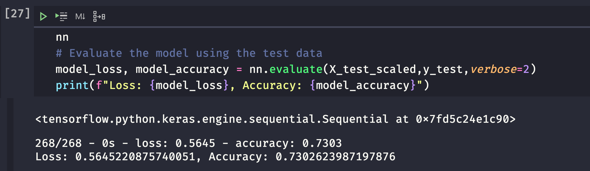
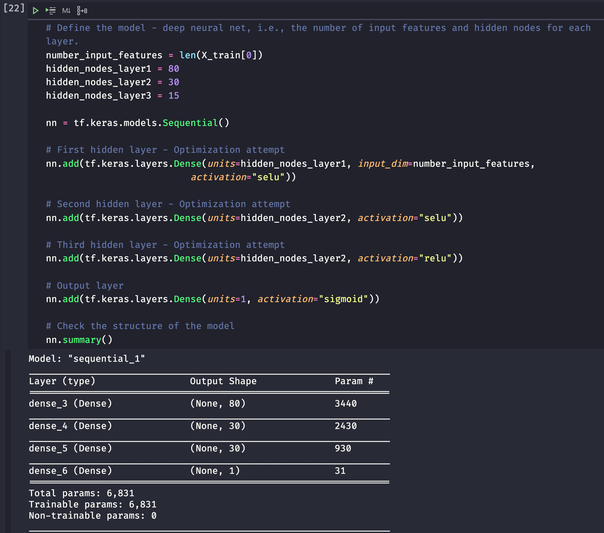

# Neural Network Charity Analysis

## Overview

Beks is a data scientist and programmer for the non-profit foundation **Alphabet Soup**. They're a philanthropic foundation dedicated to helping organizations that protect the environment, improve people's well-being, and unify the world. Alphabet Soup has raised and donated over 10 billion dollars in the past 20 years. This money has been used to invest in lifesaving technologies and organize reforestation groups around the world. Beks is in charge of data collection and analysis for the entire organization. Her job is analyze the impact of each doantion and vet potential recipients. This helps ensure that the  foundation's money is being used effectively. Unfortunately, not every donation the comapany makes is impactful. In some cases an organization will take the money and disappear. As a result, Aphabet Soup's president Andy Glad has asked Beks to predict which organizations are worth donating to and which are too high risk. He wants her to create a mathematical data driven solution that can do this accurately. Beks has decided that this problem is too complex for the statistical and machine learning models that she has used. Instead she will designa and train a deep learning neural network. This model will evaluate all types of input data and produce a clear decision making result. 

In this module, I will help Beks learn about neural networks and how to design and train these models using the Python TensorFlow library. I will rely on my past experience with statistics and machine learning to help test and optimize your models.

## Objective of this assignment
Beks is now ready to put her skills to work to help the foundation predict where to make investments. Beks and I will use the features in the provided dataset to help Beks create a binary classifier that is capable of predicting whether applicants will be successful if funded by **Alphabet Soup**.

## Resources
* Software/Tools: Visual Studio Code (v1.49.2), Anaconda 8, Jupyter Notebook
* Language(s): Python 3.7.6
* Libraries: TensorFlow, Keras, Pandas, sklearn

## Results

### Data Preprocessing
* What variable(s) are considered the target(s) for your model?
    * IS_SUCCESSFUL
* What variable(s) are considered to be the features for your model?
    * APPLICATION_TYPE
    * AFFILIATION
    * CLASSIFICATION
    * USE_CASE
    * ORGANIZATION
    * STATUS
    * INCOME_AMT
    * SPECIAL_CONSIDERATIONS
    * ASK_AMT 

* What variable(s) are neither targets nor features, and should be removed from the input data?
    * EIN
    * NAME

## Compiling, Training, and Evaluating the Model
* How many neurons, layers, and activation functions did you select for your neural network model, and why?
    * I chose 2 layers of hidden_nodes for my model to get better deep learning and as I figured more layers may lead to overfitting. The first layer had 80 neurons and the second layer had 30 neurons following the rule of thumb that your first layer should contain roughly 2-3x the amount of inputs that your model contains (43 in this case). As for the activation functions, I chose to use the relu functions fas it simplifies the output. Finally, the Sigmoid function was chosen as the output activation function as it transforms the data to a range between 0 and 1 which makes it easier for the model to classify the whether a business is likely to be successful or not.

* Were you able to achieve the target model performance?
    * No I was not able to touch the target model performance of 75%, I was close and touched 73% after multiple attempts through experimentation.
    
    
    
* What steps did you take to try and increase model performance?
    * In order to try and achieve the target 75% performance I tried a couple of things. In my first attempt, I tried to increase the accuracy by increasing the number of neurons in the first and second layers but only got a 58% accuracy. In my second attempt, I tried to reduce the number of "noisy" inputs that I fed to my model, this led to a better accuracy of 62%. Finally, I tried to increase the number of values in each bin to reduce the number of unique values that the model evaluated. Again, my accuracy rating went up to 73% but failed to meet or exceed 75%.
    
    

## Summary

Unfortunately my model output was not able to exceed 75% accuracy. However, the results revealed that there were things that could lead to better model performance. As a recommendation for better model performance we can take a better look at the data introduced in the preprocessing section. Here we can reduce noisy variables such as "STATUS" and exclude them as features. Moreover, it appears that adding more neurons also seems to improve model performance. Finally, it appears that grouping some of the more unique values/making larger bins that group unique values together also leads to better performance. 
